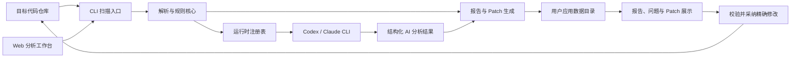

# LogPilot 技术方案

## 架构摘要

LogPilot MVP 采用 Python CLI 核心加本地 Web 分析工作台。CLI 负责扫描仓库、识别日志、执行规则分析、调用本机运行时、生成报告和 Patch；Web 工作台支持选择仓库与 Codex/Claude 运行时，并展示当前与历史结果。

图示说明：核心扫描能力不依赖 UI；规则分析留在本地进程，AI 分析批量交给选定的本机运行时。所有产物进入用户应用数据目录，只有用户确认采纳后才校验并修改目标源码。

## 模块划分

- `scanner` 遍历仓库并过滤无关目录。
- `parsers` 识别 Python、Java、JavaScript、TypeScript 中的常见日志调用。
- `rules` 检测禁用日志、低价值日志、重复日志、敏感字段和异常缺失日志。
- `runtime` 发现并锁定 Codex/Claude 可执行文件，检测版本、健康状态并受控执行命令。
- `ai` 构建批量日志 Prompt，校验结构化返回并转换为问题；配置默认关闭，UI 显式选择运行时后启用。
- `reporting` 输出最新 `report.json` 和 `report.md`。
- `storage` 按仓库规范化路径的 SHA-256 将产物隔离到用户应用数据目录。
- `history` 将每次扫描保存到 `repositories/<repository_id>/runs/<run_id>/`。
- `patching` 生成可审查 Diff，`remediation` 负责精确校验、原子采纳、备份和回滚。
- `web` 提供目录与运行时选择、一键扫描、历史记录、问题审查、批量采纳和回滚。

## 运行时安全边界

- Codex 使用 `exec --ephemeral --sandbox read-only`，Claude 使用 `--tools "" --permission-mode plan`。
- 所有命令使用参数数组直接启动，不经过 Shell 拼接；分析 Prompt 通过标准输入传递。
- 单次扫描批量提交日志并设置超时，返回值必须符合预设 JSON Schema。
- 可通过 `LOGPILOT_CODEX_PATH`、`LOGPILOT_CLAUDE_PATH` 固定可执行文件路径。
- 扫描不写入目标仓库；`.logpilot.yaml` 仅作为可选的用户配置读取。
- 采纳前校验原始行及上下文，事务备份统一保存在用户目录，源码变化时拒绝写入或回滚。

## MVP 约束

当前实现优先保证本地可运行和可测试，因此核心路径不强依赖第三方库。后续可在现有边界后替换为 Typer、FastAPI、Pydantic 和 Tree-sitter，而不改变用户命令、Web 操作流程、最新报告产物和历史 run 结构。
