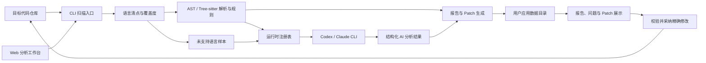

# LogPilot 技术方案

## 架构摘要

LogPilot MVP 采用 Python CLI 核心加本地 Web 分析工作台。CLI 负责扫描仓库、识别日志、执行规则分析、调用本机运行时、生成报告和 Patch；Web 工作台支持选择仓库与 Codex/Claude 运行时，并展示当前与历史结果。

图示说明：核心扫描能力不依赖 UI。扫描先清点仓库语言，再区分完整支持、有限支持、未支持和未知语言；规则分析留在本地进程，AI 分析批量交给选定的本机运行时。所有产物进入用户应用数据目录，只有用户确认采纳后才校验并修改目标源码。

## 模块划分

- `languages` 集中维护语言、扩展名、支持等级与解析器能力。
- `scanner` 单次遍历仓库，清点源码、过滤无关目录，并保留未支持语言和解析失败统计。
- `parsers` 在主进程使用 Python AST 和有限文本解析器；`native_parser_worker` 在隔离子进程中使用 Tree-sitter C/C++ 语法树识别常见日志调用。
- `rules` 检测禁用日志、低价值日志、重复日志、敏感字段和异常缺失日志。
- `runtime` 发现并锁定 Codex/Claude 可执行文件，检测版本、健康状态并受控执行命令。
- `ai` 分层执行自定义日志框架识别、已知日志质量审查、异常路径缺失日志分析和未支持语言抽样；返回值必须匹配本地目标 ID，成功响应按运行时版本与 Prompt 缓存。
- `reporting` 输出最新 `report.json` 和 `report.md`，并根据覆盖度、日志样本和 AI 完整性决定是否生成数值评分。
- `storage` 按仓库规范化路径的 SHA-256 将产物隔离到用户应用数据目录。
- `settings` 保存仓库级语言选择与固定日志模板，并根据文件及现有日志生成语言画像和模板推荐。
- `fixes` 将规则问题转换为统一的删除、替换或插入修复；Python 异常日志会在 AST 语法校验通过后才成为可采纳项。
- `history` 将每次扫描保存到 `repositories/<repository_id>/runs/<run_id>/`。
- `patching` 根据统一修复模型生成可审查 Diff，`remediation` 负责精确校验、跨文件原子采纳、备份和回滚。
- `web` 提供目录与运行时选择、一键扫描和历史记录，并以按文件分组的纵向结果流就地展示原因、源码与 Diff，支持单项或文件级批量采纳及回滚。

## 运行时安全边界

- Codex 使用 `exec --ephemeral --sandbox read-only`，Claude 使用 `--tools "" --permission-mode plan`。
- 所有命令使用参数数组直接启动，不经过 Shell 拼接；分析 Prompt 通过标准输入传递。
- 单次扫描批量提交日志并设置超时，返回值必须符合预设 JSON Schema。
- 快速、标准、深度三档分别控制 AI 日志和候选目标上限，不改变本地语言清点与规则扫描。
- 单批 AI 失败不会丢弃本地结果；报告标记为“AI 未完成”并停止给出数值评分。
- 未支持语言只允许生成带来源的抽样洞察，不计入扫描覆盖率，也不生成自动 Patch。
- 一个扫描任务复用一个 C/C++ 工作进程，每次只解析一个文件；崩溃、超时或协议错误仅标记当前文件并重建进程。
- Tree-sitter `0.25.2`、C grammar `0.24.2` 和 C++ grammar `0.23.4` 作为一个兼容组合锁定，升级前必须运行真实 C/C++ 回归仓库。
- 可通过 `LOGPILOT_CODEX_PATH`、`LOGPILOT_CLAUDE_PATH` 固定可执行文件路径。
- 扫描不写入目标仓库；`.logpilot.yaml` 仅作为可选的用户配置读取。
- 语言选择、模板与仓库风格画像保存在用户数据目录；模板按“用户固定、仓库推荐、内置安全模板”顺序解析。
- 采纳前校验原始行及上下文，事务备份统一保存在用户目录，源码变化时拒绝写入或回滚。

## MVP 约束

当前实现优先支持 Python 与 C/C++ 仓库。Java、JavaScript、TypeScript 为有限支持；其他已知和未知语言会明确显示未扫描数量，并以 `N/A` 代替误导性的健康评分。新增语言应先在 `languages` 注册，再提供确定性解析器；AI 只用于扩展识别和语义判断，不能冒充完整语法覆盖。
