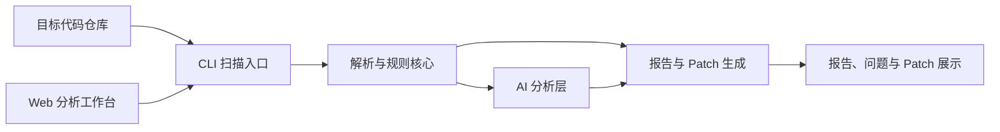

# LogPilot 技术方案

## 架构摘要

LogPilot MVP 采用 Python CLI 核心加本地 Web 分析工作台。CLI 负责扫描仓库、识别日志、执行规则分析、生成报告和 Patch；Web 工作台支持弹出本地目录选择窗口、输入仓库路径、点击分析，并展示当前与历史结果。

图示说明：核心扫描能力不依赖 UI；Web 工作台通过本地 API 触发扫描，并展示扫描产物，避免把 MVP 变成复杂平台。

## 模块划分

- `scanner` 遍历仓库并过滤无关目录。
- `parsers` 识别 Python、Java、JavaScript、TypeScript 中的常见日志调用。
- `rules` 检测禁用日志、低价值日志、重复日志、敏感字段和异常缺失日志。
- `ai` 提供 OpenAI 兼容 Provider 边界，默认关闭，避免未经确认发送代码。
- `reporting` 输出最新 `report.json` 和 `report.md`。
- `history` 将每次扫描保存到 `.logpilot/runs/<run_id>/`，供历史记录页读取。
- `patching` 只生成可审查 Diff，不直接改源码。
- `web` 提供本地分析工作台，支持目录选择、路径输入、一键扫描、历史记录、总览、问题、日志、AI trace 和 Patch 展示。

## MVP 约束

当前实现优先保证本地可运行和可测试，因此核心路径不强依赖第三方库。后续可在现有边界后替换为 Typer、FastAPI、Pydantic 和 Tree-sitter，而不改变用户命令、Web 操作流程、最新报告产物和历史 run 结构。
